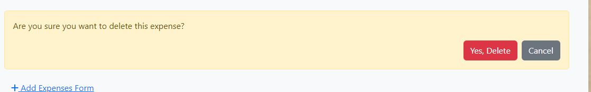

## Introduction ##

I've developed a budget expenses project where users can add their monthly budget and expenses for various products. This allows them to track and identify which products have higher expenses compared to others.
This repository contains the React frontend for TribeHub. The project also uses a web API built with Django Rest Framework, and you can find that API's repository [here](https://github.com/meena-rathi/drf_api_expenses).

## User Personas ##

- A user can manage their budget and expense.

## User Stories ##

* I have designed the user stories outlined in my [GitHub project](https://github.com/users/meena-rathi/projects/3).
* I followed the agile methodology to implement my project using GitHub Projects.
* Each user story has its own acceptance criteria. 

The user storys in my GitHub project are as follows:

* As a site user, I can easily create an account to access the website.
* As a site user, I can add a monthly budget. 
* As a site user, I can add the expenses.
* As a site user, I can see total amount of expenses substract from the buget.
* As a site User, I can edit and delete the expenses.
* As a site User, I can expeses in the pie chart.

## User Goals ##

1. New User: 

- I can navigate the website without any hassle.
- The website provides enough information for me to understand what the expenses tracking is about.
- The sign-up process is easy and straightforward.

2.  Pervious user:

- Signing in is easy.
- I can view and manage my expenses.

- - -

## Technologies Used

### Languages Used:

HTML, CSS, javascript and Python Django Rest Framework (backend) were used to create this website.

### Frameworks, Libraries & Programs Used:

- Git - For version control.

- Github - To save and store the files for the website.

- React-Bootstrap Version 4.6 - The framework for the website. Code for the navigation bar, containers, rows and forms were used and modified. Additional CSS styling was also implemented in style.css.

- Google Fonts - To import the fonts used on the website.

- Font Awesome - For the iconography on the website.

- Google Dev Tools - To troubleshoot and test features, solve issues with responsiveness and styling.

- React-Router-DOM is a library for managing routing and navigation in React applications.

- Axios is a promise-based HTTP client for making requests and handling responses in JavaScript applications.

- React Chart.js 2: The React wrapper for Chart.js, used to integrate and display the pie chart.

- Chart.js: A JavaScript library that renders charts, such as the pie chart used in TaskFlow.

- ReactDOM is a library that provides methods to render React components into the DOM and manage the lifecycle of those components.

## Design

### Wireframes

These are wire frames of my website.

### Feature

These are wire frames of my website.

- Before logging in, users must sign up for an account..

If the username already exists or the password does not match, an error message must be displayed.

- Once the user is logged in, they can add expenses, which must then be displayed in a table.

 
- The user can see all the expenses and the monthly budget. They can view the remaining budget and the total expenses.

- The user can edit the expenses.

- The user can delete the expenses.

- The user can delete the expenses.

- The user can click on a toggle to view the form and enter the monthly budget. If they wish to increase the budget, they can do so easily.

- Once the user submits the expense form, they can see the updated list of expenses.

- The user can see the expenses ratio displayed in a pie chart.

### Data Models

The data models were designed at the same time as the wireframes. You can find details about them in the read-me for the [Expenses Tracking Django Rest Framework API](https://github.com/meena-rathi/drf_api_expenses).

## Fonts ##

- The 'sans-serif' font family, a sans-serif typeface, has been selected for use across the resturtant project. 

- Font Colors: The color scheme for text is primarily brown, gray and white, blue.

### React-Reusable Components
Reusable components that are customizable and easy to install via npm.

Below, I'll highlight the key components and hooks:

#### NavBar Component

The NavBar component adds a navigation bar to your application. It includes links to different pages and can be customized with actions specific to the user. This component is inspired by the CI walkthrough project, "Moments."

1. At the top of your JavaScript or JSX file, import the NavBar component like this:

-   import NavBar from './components/NavBar';

**Props**
Here are the props you can use with the NavBar component:

- currentUser: The current user object.
- setCurrentUser: A function to manage user actions.
- expanded: Controls whether the navigation menu is expanded.
- ref: A reference to manage clicks outside the menu.

- - -

#### Asset Component

The Asset component is a reusable tool for showing assets like images or spinners, along with optional messages. It’s inspired by the CI walkthrough project, "Moments."
1. At the top of your JavaScript or JSX file, import the Asset component like this:
    - import Asset from './components/Asset';

**Props**
- Here are the props you can use with the Asset component:

- spinner: Set to true to show a spinner animation.
- src: Provide the URL for the image source.
- message: Display a message below the asset.

- - -

#### Avatar Component

The Avatar component is a reusable tool for showing user avatars, with the option to add text. It’s inspired by the CI walkthrough project, "Moments."

1. At the top of your JavaScript or JSX file, import the Avatar component like this:
    - import Asset from './components/Avatar';

**Props**
- src: The URL for the avatar image.
- height: The height of the avatar (default is 45 pixels).
- text: Additional text to display with the avatar.

- - -

#### CurrentUserProvider Context

The CurrentUserProvider component is a reusable tool that offers a context for managing the current user's state and handling authentication tasks. It’s inspired by the CI walkthrough project, "Moments."
1. Import the CurrentUserProvider component at the top of your JavaScript or JSX file:
    - import CurrentUserProvider from './components/CurrentUserProvider';

2. Wrap your application or a specific section of it with the CurrentUserProvider component:
    
`<CurrentUserProvider>
  {/* Your application components */}
</CurrentUserProvider>`

 **Context**
The CurrentUserProvider component provides two contexts:

- CurrentUserContext: Contains information about the current user.
- SetCurrentUserContext: Provides a function to update the current user.

- - -

#### UserProfileProvider Context

The UserProfileProvider component is a reusable tool that offers a context for managing user profile information related to the current user.

1.  Import the UserProfileProvider component at the top of your JavaScript or JSX file:
     -   import { UserProfileProvider } from './context/UserProfileProvider';

2. Wrap your application or a specific section of it with the UserProfileProvider component:
`<UserProfileProvider>
  {/* Your application components */}
</UserProfileProvider>`

**Context**
The UserProfileProvider component offers a context called UserProfileContext, which includes:

- userProfile: The user's profile information.
- setUserProfile: A function to update the user's profile information.
- You can use this context to access and manage user profile data within your application.

- - -

#### useRedirect Hook

The useRedirect hook is a custom hook that handles redirection based on user authentication status. It's a flexible tool for managing user authentication redirects in your React application. It’s inspired by the CI walkthrough project, "Moments."

1. Import the `useRedirect` hook at the top of your JavaScript or JSX file:
    -  import { useRedirect } from './hooks/useRedirect';

2. Use the useRedirect hook in a component where you want to manage redirects based on user authentication status. Pass the authentication status as an argument:

`const YourComponent = () => {
  useRedirect(userAuthStatus);
};`

Here, userAuthStatus can be one of these values:
- 'loggedIn': Redirects to the homepage if the user is logged in.
- 'loggedOut': Redirects to the homepage if the user is not logged in.

- - -

#### useClickOutsideToggle Hook

The useClickOutsideToggle hook helps manage a component's toggling when you click outside of it. It’s useful for making elements like the Navigation Bar expand or collapse when you click outside of them, especially on smaller screens. This hook is inspired by the CI walkthrough project, "Moments."

1. Import the `useClickOutsideToggle` hook at the top of your JavaScript or JSX file:
   - import useClickOutsideToggle from './hooks/useClickOutsideToggle';

2. Use the useClickOutsideToggle hook in a component where you want to handle clicks outside a specific element. The hook returns an object with state variables and a ref.

`const YourComponent = () => {
  const { expanded, setExpanded, ref } = useClickOutsideToggle();
};`

- expanded: A boolean indicating whether the component is currently expanded or not.
- setExpanded: A function to manually set the toggle state.
- ref: A reference that should be attached to the element you want to track for click events.

## CRUD functionality

- Create: logged in User can add their expenses.
- Update:  logged in User can delete their expenses.
- Read:  logged in User can see their expenses.
- Delete: logged in User can delete their expenses.

## Testing 

| Test       | Expected           | Passed  |
| :------------- |:-------------:| :-----:|
| User clicks sign out | User is signed out and directed to the logged-out home page | ✅ |
| User logs in / registers | Nav links change and access to home page becomes available | ✅ |
| User clicks '+ toggle'| budget form displayed | ✅ |
| User enter the monthly budget | budget displayed on the home page | ✅ |
| User enters the monthly budget and wants to increase it | Increased budget is displayed on the home page | ✅ |
| User enter (invalid data) | Error / Invalid messages | ✅ |
| User clicks ‘+ toggle’ | expenses from displayed | ✅ |
| User enters the expenses | Expenses are displayed in a table on the home page | ✅ |
| User clicks edit button | Directed to edit project page with prepopulated form | ✅ |
| User updates expenses (valid data) | Project details updated successfully and redirected to previous page | ✅ |
| User updates project (invalid data) | Error / Invalid messages | ✅ |
| User clicks delete icon on expenses page | expenses is deleted and redirected to home page | ✅ |
| Total expenses | Total amount is calculated based on the entered expenses | ✅ |
| User logs in / registers | Nav links change and access to home page becomes available | ✅ |
| User clicks '+ toggle'| budget form displayed | ✅ |
| User enter the monthly budget | budget displayed on the home page | ✅ |
| User enters the monthly budget and wants to increase it | Increased budget is displayed on the home page | ✅ |
| User enter (invalid data) | Error / Invalid messages | ✅ |
| User clicks ‘+ toggle’ | expenses from displayed | ✅ |
| User enters the expenses | Expenses are displayed in a table on the home page | ✅ |
| User clicks edit button | Directed to edit project page with prepopulated form | ✅ |
| User updates expenses (valid data) | Project details updated successfully and redirected to previous page | ✅ |
| User updates project (invalid data) | Error / Invalid messages | ✅ |
| User clicks delete icon on expenses page | expenses is deleted and redirected to home page | ✅ |
| Total expenses | Total amount is calculated based on the entered expenses | ✅ |
| User completes create task form and submits (valid data) | Task created and redirected to previous page | ✅ |
| User completes task form and submits (invalid data)| Error / Invalid messages | ✅ |
| User clicks edit task button | Directed to edit task page with prepopulated form | ✅ |
| User updates task (valid data) | Task details updated successfully and redirected to related project page | ✅ |
| User updates task (invalid data) | Error / Invalid messages | ✅ |
| User clicks delete icon on task page | Task is deleted and redirected to landing page | ✅ |
| User clicks project card | Directed to the Project page | ✅ |
| User clicks task card | Directed to the Task page | ✅ |
| User types in the search bar on landing page | Project cards are filtered to match search | ✅ |
| User clicks sign out | User is signed out and directed to the logged-out home page | ✅ |

#### Fixed Bugs

| Bugs | Fixed |
| :----------- | :-----:|
| If the user wants to increase their budget, the new budget must display the sum of the previous budget plus the current entry. | ✅ |
| User can edit the expenses| ✅ |
| The remaining amount should be calculated and displayed based on the difference between the monthly budget and the total expenses.| ✅ |
| display sum of total expenses| ✅ |

## Deployment

- To deploy Expenses Tracking to GitHub and Heroku, follow these steps:

- Start by creating a new app on Heroku.

- Link the Heroku app to your GitHub repository.

- Turn on automatic deployments in Heroku. This ensures that any changes pushed to the main branch on 
GitHub will automatically trigger a deployment on Heroku.

- In the Heroku app settings, add any necessary environment variables (e.g., database connection strings, API keys).

- Create a Procfile in your project. This file tells Heroku the command to run your app.

- Ensure your app is production-ready by running any necessary build or compilation tasks.
Verify that all required dependencies are installed and properly configured.

- Push your code to the main branch of your GitHub repository to trigger the Heroku deployment process.

- Keep an eye on the Heroku logs to ensure the deployment is successful and troubleshoot any errors if they arise.
________________________________________
Connecting the React Front-End to Django API

To integrate the React front-end with the Django API, follow these steps:

1.	Heroku Setup:
	
  - In the Heroku dashboard, go to your Django Rest Framework (DRF) API project.

2.	Configure Variables:
  
  - Add a config variable called CLIENT_ORIGIN and set it to the URL of the deployed React app.
  
  - Also, add a CLIENT_ORIGIN_DEV variable with the Gitpod preview link. Update this link when needed, as Gitpod URLs may change.

3.	Install Axios:
  
  - In the React project, install Axios by running the command:
  -  npm install axios

4.	Set Up Axios:
	
  - Create an api folder, and inside it, create an axiosDefaults file.
	
  - In this file, import Axios, then configure it by setting the baseURL to the deployed API's URL.
	Ensure the content-type header is set to handle multipart/form-data requests and enable - - 
    
    - withCredentials to manage cookies and avoid CORS issues.

5.	Integrate Axios:
	
   - Import this Axios configuration into the App.js file of your React app to enable communication with the Django API.
   
   - These steps ensure that your React app can interact properly with the Django TaskFlow API.

## Forking the Taskmaster_react Repository

1.	Log in (or create an account) on GitHub.
2.	Visit the repository for the project at Neillcllghn/taskmaster_react.
3.	Click the Fork button in the upper right corner of the page.
________________________________________

## Cloning the Repository

1.	Log in (or create an account) on GitHub.
2.	Navigate to the repository for this project at Neillcllghn/taskmaster_react.
3.	Click the Code button, choose whether to clone using HTTPS, SSH, or GitHub CLI, and copy the provided link.
4.	Open your terminal and change the current working directory to where you want the cloned repository to be saved.
5.	In the terminal, type git clone, paste the link from step 3, and hit enter.

#### Credits

- https://github.com/mr-fibonacci/moments/tree/d2de51e78e4b991787d8be1594688e3fba2446d0

- https://stackoverflow.com/questions/57663559/how-to-sum-react-component-values

- https://stackoverflow.com/questions/65855371/how-to-display-data-to-table-in-react-js

- https://stackoverflow.com/questions/77360640/how-do-i-get-my-reactjs-pie-chart-display

#### Acknowledgments

I would like to express my gratitude to the following individuals:

- My Mentor, jubril, whose guidance and support have been invaluable.
- Markus, my classmate, who provided significant assistance with my readme file.
- kristyna_ci, whose contributions were immensely helpful throughout the project.
- Thanks to all my classmates who provided feedback about my project. How can I make it even better?
